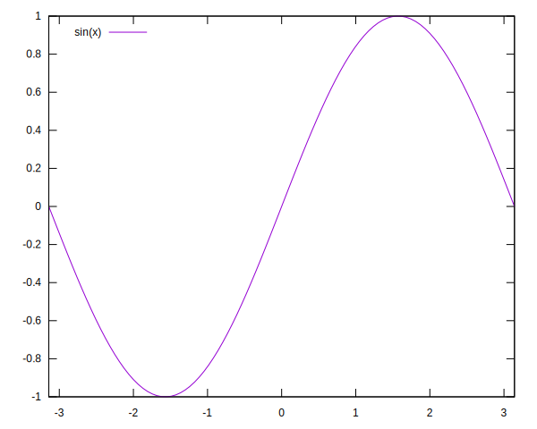
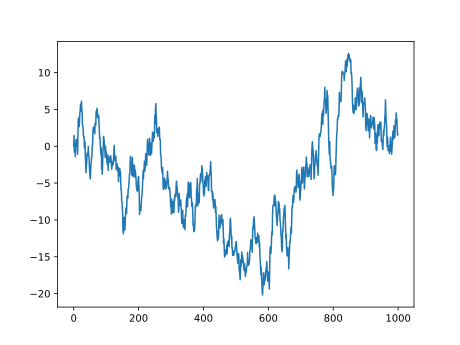

With Entangled and Brei you can automate your work from within Markdown. Similar to how you would integrate data analysis and visualisation in a Jupyter notebook, Entangled with Brei lets you put all your important code where you want it, and have the research output be directly linked to the presented content. However, Entangled uses a much more powerful literate programming idiom and Brei a much more comprehensive evaluation strategy. Meaning:

- Entangled: You write code where and how you want it presented.
- Brei: Results are computed only once, or when input data or source code actually changed.

The design of both Entangled and Brei was done with some important core values in mind:

- readability: do I understand what the authors have done precisely?
- reproducibility: do I get the same results repeating the exact same instructions as the authors?
- replicability: do I get similar results by reinterpreting the authors instructions or using a different but equivalent data set?
- reusability: can I reuse what the authors did and apply it to my own work?

:::info
If you are familiar with GNU Make, you could also choose to use Make instead of Brei. Here are some reasons why you might use Brei:

- Some members of your team run on Windows and don't have GNU Make installed.
- Your workflows will be configured in TOML or JSON. Users won't have to learn a new language.
- JSON support makes writing workflow generators easier.
- Your workflows become more portable.
- You have fewer dependencies (only Python &\ge 3.11), so your work becomes easier to reuse.

That being said, Make is the more tried and proven alternative, and similar results can be achieved with it. Entangled has a `build` hook that utilizes Make much in the same manner as the `brei` hook does Brei.

There are many other scientific workflow systems that function similar to Brei, all with a slightly different usability focus or user community.
:::

# Project setup
To start a new project with the same features as shown here, you can use the `pandoc` project template. In addition to installing Entangled (`pip install entangled-cli`) you'll need [Pandoc with Lua support](https://pandoc.org/installing.html).

```bash
# this is a work in progress, the pandoc template is not yet available,
# rather it will be extracted from the current repository (example-brei)
entangled new pandoc my-awesome-project
```

The Entangled configuration looks as follows:

``` {.toml file="entangled.toml"}
version = "2.0"
watch_list = ["docs/*.md"]
hooks = ["quarto_attributes", "brei"]

<<brei>>
```

We have enabled both the `quarto_attributes` and `brei` hooks. Quarto is a project that combines the powers of RMarkdown with Jupyter, and is relatively easy to use. In Quarto you can add attributes to code blocks by including them in comments with a vertical bar `|` added:

```python
#| description: prints a friendly message
print("Hi!")
```

With `quarto_attributes` enabled, Entangled will behave as if those attributes are part of the attributes inside the code block curly braces. It is important that the `quarto_attributes` go first, as the hooks will be evaluated in order of appearance in the config.

The `brei` hook will extract tasks from the literate source, and put them in `.entangled/tasks.json`. The `pandoc` project template also ships with a workflow in `docs/weave.toml` that helps building HTML output using Pandoc. We can include those files:

``` {.toml #brei}
[brei]
include = ["docs/weave.toml", ".entangled/tasks.json"]
```

In this example, we will be doing some plotting with Gnuplot, mainly to show how easy it is to setup.

``` {.toml #brei}
[brei.runner.gnuplot]
command = "gnuplot"
args = ["${script}"]
```

We will put all figures in `docs/fig`. Some people will browse the documentation on Github, putting figures there makes sure that relative paths work for both the Markdown and the rendered HTML. When we build the website, we need to copy those figures to `docs/site/fig`. Currently no glob patterns are supported yet, so we need to list all figures in there.

``` {.toml #brei}
[[brei.call]]
template = "copy"
collect = "copy-figures1"
[brei.call.args]
srcdir = "docs/fig"
tgtdir = "docs/site/fig"
basename = ["sine.svg"]

[[brei.call]]
template = "pandoc"
collect = "html"
[brei.call.args]
basename = ["index"]

[[brei.task]]
name = "weave"
requires = ["#html", "#static", "#copy-figures1", "#copy-figures"]
```

# Plotting
For our first example, we create a simple plot using Gnuplot. The following creates a plot of a sinus function. The `stdout` output of Gnuplot is passed to the file `docs/fig/sine.svg`. Then we include that file in the Markdown with normal image syntax.

``` {.gnuplot .task}
#| description: plot a sine
#| stdout: docs/fig/sine.svg
set term svg background "white"
set xrange [-pi:pi]
set key top left
plot sin(x)
```



# Generating Data
The above example is kind of trivial. Usually, when you do serious work, you run a computation that might take a while, then move on to visualize its results, and so on. If you change something in the middle of your analysis, you don't want to rerun the entire computation. Also, suppose you want to know which version of your software created a certain result. We can involve Git here. We create two tasks, one that obtains the current git commit id, and the other creates the directory where output will go.

``` {.toml #brei}
[[brei.task]]
description = "Obtain git commit id"
stdout = "var(commit)"
script = "git rev-parse --verify HEAD"

[[brei.task]]
description = "Create data output dir"
name = "output-prep"
script = """
mkdir -p data/${commit}
ln -sf ${commit} data/latest
"""
```

Now, to test this, we write a script that writes to the folder of the current git commit.

``` {.python .task}
#| description: Generate data
#| creates: data/${commit}/output.csv
#| requires: #output-prep
#| collect: data
import numpy as np
import pandas as pd
from itertools import islice, accumulate

def white_noise():
    while True:
        yield np.random.normal()

N = 1000
y = np.fromiter(accumulate(white_noise()), dtype=float, count=N)

df = pd.DataFrame({"y": y})
df.to_csv("data/${commit}/output.csv")
```

In a next script we can read the generated data and produce a figure.

``` {.python .task}
#| description: plot brown noise
#| creates: data/${commit}/brown-noise.svg
#| requires: data/${commit}/output.csv
#| collect: figures
import pandas as pd
from matplotlib import pyplot as plt

data = pd.read_csv("data/${commit}/output.csv", index_col=0)
fig, ax = plt.subplots()
data.plot(ax=ax)
fig.savefig("data/${commit}/brown-noise.svg")
```

``` {.toml #brei}
[[brei.call]]
template = "copy"
collect = "copy-figures"
[brei.call.args]
srcdir = "data/${commit}"
tgtdir = "docs/site/fig"
basename = ["brown-noise.svg"]
```


